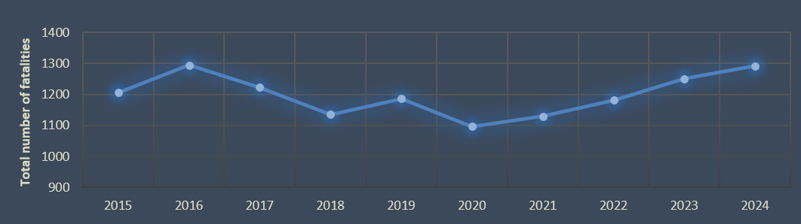
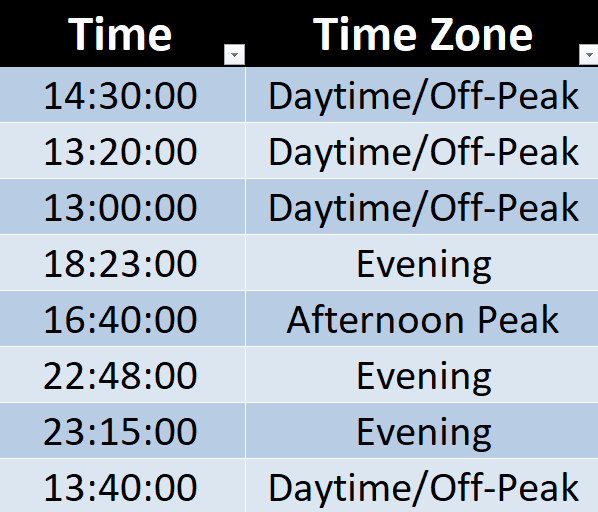

# Understanding Road Fatalities in Australia: A Data‑Driven Insight for Smarter Road Safety Decisions

## Overview
Road safety remains a critical public health challenge in Australia. Despite investments in enforcement, infrastructure, and education, the national annual fatality trend across the last 10 years remains relatively stable. This project investigates why that may be the case and identifies the high‑impact groups that should be prioritised for targeted interventions.

*Annual fatalities trend over the last 10 years in Australia.*

## 1. Problem Statement
Although multiple agencies run road safety programs, the persistent average number of annual fatalities suggests limited effectiveness of current strategies. This project focuses on uncovering patterns by state, demographic group, road environment, and temporal factors to identify high-contributing groups, enabling better policy prioritisation and more effective allocation of limited resources.

## 2. Dataset
- Source: [National Road Safety Data Hub](https://datahub.roadsafety.gov.au/)
- Dataset: [Australian Road Deaths Database (Sept 2025)](https://datahub.roadsafety.gov.au/sites/default/files/documents/Australian%20Road%20Deaths%20Database%20September%202025.xlsx)
- Years analyzed: Last 10 years (2015–2024)

## 3. Tools Used
- **Microsoft Excel** — for data transformation, cleaning, pivot tables, slicers, and interactive dashboard layout
- **Charts & Graphs** — bar charts, pie charts, and line charts for KPI visualization
- **Interactive Features** — slicers and tick boxes for dynamic KPI filtering

## 4. Data Cleaning & Preparation
Key steps included:
- **Missing values:** Labeled as "Unknown"
- **Year filter:** Last 10 years selected
- **Category grouping:** Granular variables (e.g., speed limits) consolidated into logical ranges: 0–29, 30–59, 60–89, 90–119, 120+ km/h
- **Derived columns:** Months, Maximum Speed Limit Groups, Age Groups, Time-of-Day Groups, Road User Groups

*Example of Time of Day grouping used to simplify KPI visualizations.*

## 5. KPI Analysis & Key Insights
The analysis was conducted across ten dimensions:

- Annual Fatalities Trend  
- Fatalities by Month  
- Fatalities by Road User  
- Fatalities by Weekday  
- Fatalities by Time of Day  
- Fatalities by Speed Limit (km/h)  
- Fatalities by Gender  
- Fatalities by State  
- Fatalities by Remoteness  
- Fatalities by Age Group  

## 6. Data Visualization & Interactive Dashboard
The dashboard presents all KPIs interactively using graphs and charts, allowing users to explore trends and patterns effectively and to:

- Select year ranges and one or multiple states  
- KPIs update automatically  
- "High-Contributing Groups" selector identifies top contributing demographic or environmental groups

*Full interactive dashboard showing KPIs and filters.*

### Highest Risk Profiles Feature
A dedicated section titled **"Highest Risk Profiles"** allows users to select any combination of KPIs via tick boxes and view the **top three contributing risk groups instantly**. This facilitates targeted decision-making for policymakers.

*Dashboard section highlighting the top contributing risk groups based on user-selected KPIs.*

## Conclusion & Next Steps
Targeted interventions guided by data are more likely to reduce road fatalities than one‑size‑fits‑all programs. By using this dashboard, policymakers and program designers can quickly identify priority groups and tailor interventions with measurable outcomes.

**Capabilities demonstrated:** complete data pipeline in Excel, thoughtful cleaning and grouping, KPI selection, interactive dashboard design, and policy‑relevant insight generation.

## Credits & Dataset
Data source: [National Road Safety Data Hub](https://datahub.roadsafety.gov.au/)

